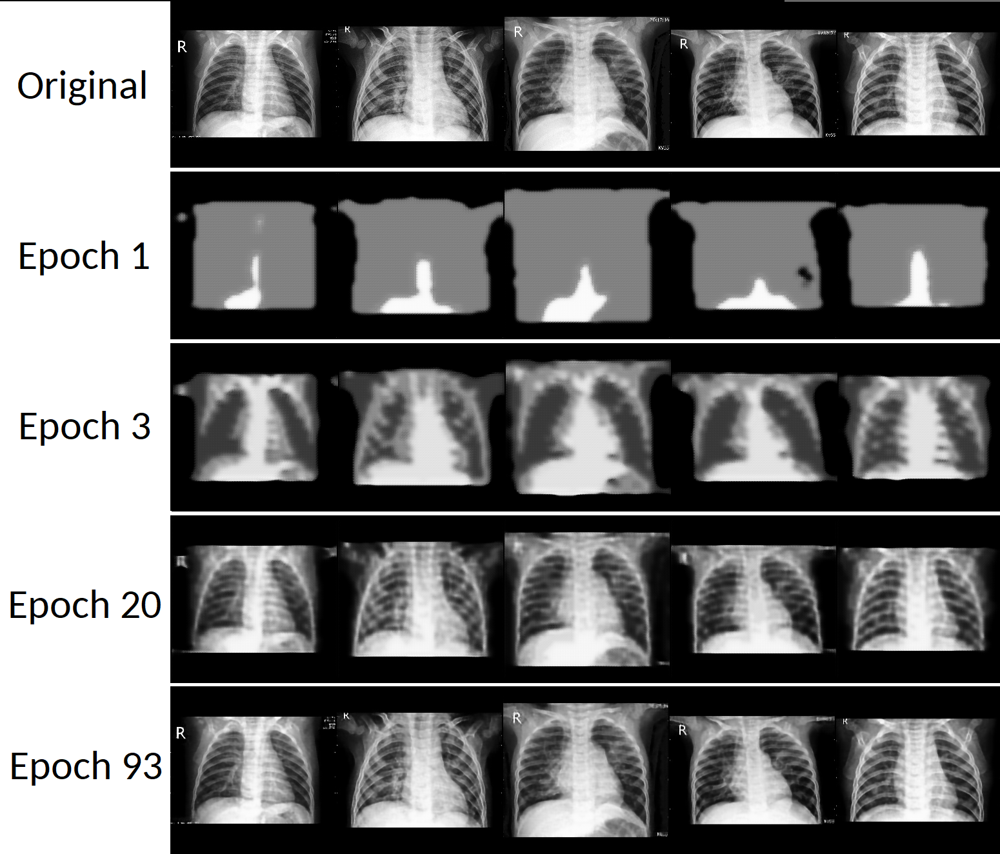
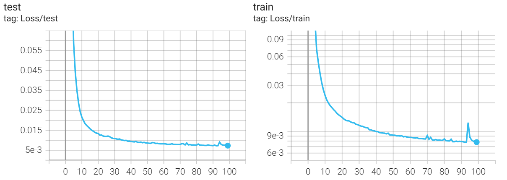
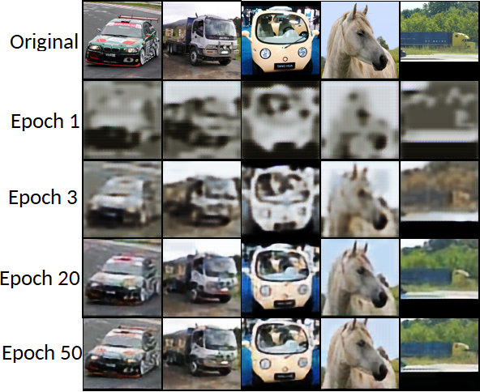
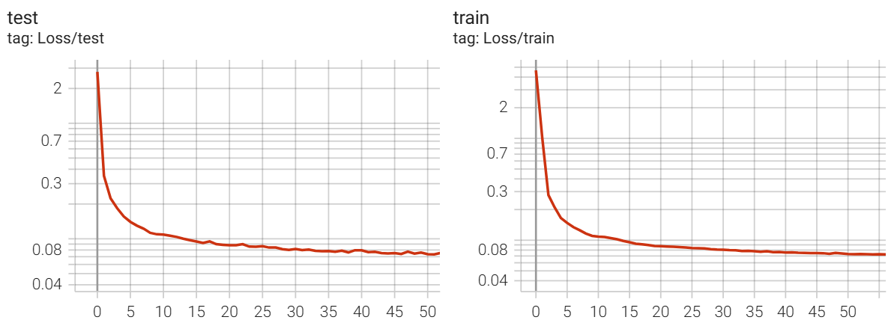
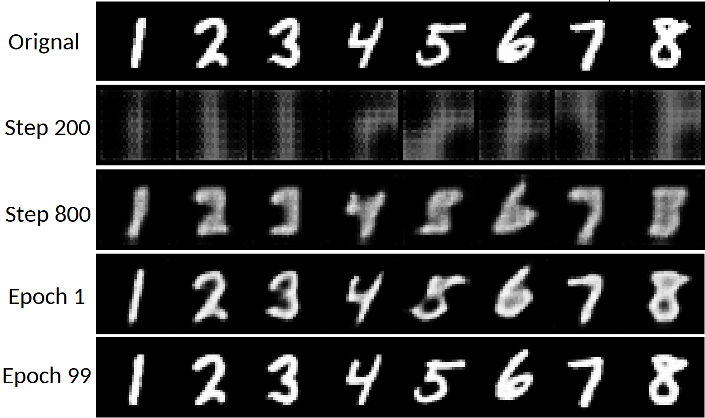

# Vector Quantized VAE implementation in PyTorch
This repository contains my PyTorch implementation of the Vector Quantized Variational Auto Encoder as described by van den Oord et al in *Neural Discrete Representation Learning* applied to images. The implementation was build according to the description in the paper, and using the official tensorflow implementation of the author.

## Introduction

A downside of having these discrete quantized vectors as the latent space is that there is no normally distributed latent space where we can sample new valid samples from. See "improvement" section how that could be changed. My actual motivation for this implementation is that i want to train such a VQ-VAE on large amount of medical images, and then use the feature extraction capabilities of the encoder to generate meaningfull encodings to improve model performance for prediction problems with litle available labelled data.

The training loop can be found in `train.py`, and the implementation of the VQ-VAE can be found in `model/vq_vae.py`

## Universal embeddings: extraction and prediction demos:
A demonstration of how a trained VQ VAE model can be used to first extract usefull features, and to then use these extracted features in a prediction model, can be found in `extract_embeddings.py` and 'predict.py'.

## Demonstration: Reconstruction on 3 different datasets
The effectivity of the implementation was shown on three different datasets: MNIST, SLT10 and a Pneumonia Chest X-Ray dataset. The datasets were chosen based on that they differ when it comes to the resolution, the diversity of images, and the presence of color.

### Pneumonia Chest X-Ray dataset
The following results were obtained on the dataset as publised in (*Identifying Medical Diagnoses and Treatable Diseases by Image-Based Deep Learning*
Kermany, Daniel S. et al.) The dataset contains a total of 5,863 images, with a resolution of 256x256, where each image is labelled with the presence or abscence of Pneumonia. see `train_x_ray.py` for the used script and hyperparameters.
#### X-Ray: Validation Reconstruction

### SLT10
The STL-10 dataset is an image recognition dataset for developing unsupervised feature learning, were a very large set of unlabeled examples is provided with a resolution of 96x96. see `train_SLT10.py` for the used script and hyperparameters.

#### SLT10: Validation Reconstruction

### MNIST
MNIST is handwritten digit recognition dataset containing 70,000 grayscale images of handwritten digits, sized 28x28 pixels. see `train_MNIST.py` for the used script and hyperparameters.

## Future steps/ improvements

### Deep Feature Encoding for Medical Data
  My actual goal in creating this implementation, is to use the embeddigs as created by this model for feature extraction of medical images, improving model performance in cases were few labelled, but plenty of unlabelled images are available, which is often the case. This will be the next step

### Hierarchical VQ-VAE
Hierarchical VQ-VAE is an extension of the VQ-VAE architecture, where different latent spaces are learned at different scales of the image, effectively retaining information at all scales. In practice this VASTLY improves the amount of detail in the reconstruction.

### PixelCNN for sampling new data
Since the latent space in VQ VAE consists of discrete codes, there is no normally distributed latent space where we can sample new valid samples from. However PixelCNN, a separate autoregressive model can be trained to effectvily generate new meaningfull samples.

